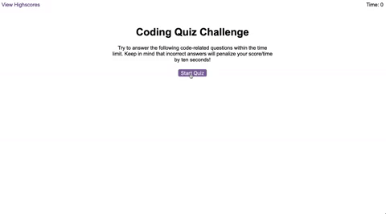

# Code Quiz Challenge

## Description

The goal is to build a timed coding quiz with multiple-choice questions, which will run in the browser and feature dynamically updated HTML and CSS powered by JavaScript code.

## Tasks

* A start button that when clicked a timer starts and the first question appears.
 
  * Questions contain buttons for each answer.
  * 
  * When answer is clicked, the next question appears
  * 
  * If the answer clicked was incorrect then subtract time from the clock

* The quiz should end when all questions are answered or the timer reaches 0.

  * When the game ends, it should display player's score and give the player the ability to save their initials and their score
  
The following animation demonstrates the application functionality:

---
© 2022 edX Boot Camps LLC. Confidential and Proprietary. All Rights Reserved.
